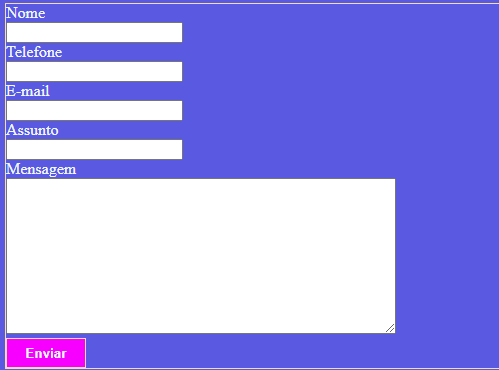

# form-contato

  Projeto criado como parte avaliativa da disciplina de Fundamentos de Desenvolvimento Web ministrada pelo professor Leonardo Rocha.
 
 ## Índice
* [Descrição](#descrição)
* [Tecnologias](#tecnologias)
* [Referências](#referências)
* [Autor(a)](#autora)

## Descrição
 
Um projeto para entrar no e-mail de HTML e CSS.

## Tecnologias
 
* HTML5
* CSS3
* Git
* Github

## Códigos

* form -The <form> HTML element represents a document section containing interactive controls for submitting information.

* label -Um elemento **HTML &lt;label&lt; **representa uma legenda para um item em uma interface de usuário. Ele pode estar associado com um elemento de controle, colocando este dentro do elemento label, ou usando o atributo for. Tal controle é chamado o controle etiquetado do elemento etiqueta. Um input pode ser associado a diversas etiquetas (<label>s).

* input-O elemento HTML &lt;input&lt; é usado para criar controles interativos para formulários baseados na web para receber dados do usuário. A semântica de um &lt;input&lt; varia consideravelmente dependendo do valor de seu atributo type.

* textarea-The &lt;textarea&gt; HTML element represents a multi-line plain-text editing control, useful when you want to allow users to enter a sizeable amount of free-form text, for example a comment on a review or feedback form. 

* button-The &lt;button&lt; HTML element is an interactive element activated by a user with a mouse, keyboard, finger, voice command, or other assistive technology. Once activated, it then performs an action, such as submitting a form or opening a dialog.

* background-color-The background-color CSS property sets the background color of an element.

* border-The border shorthand CSS property sets an element's border. It sets the values of border-width, border-style, and border-color.

* color-O tipo de dado CSS <color> indica uma cor no espaço sRGB. Uma cor pode ser descrita em qualquer uma destas formas:

* width-The width CSS property sets an element's width. By default, it sets the width of the content area, but if box-sizing is set to border-box, it sets the width of the border area.

* height-The height CSS property specifies the height of an element. By default, the property defines the height of the content area. If box-sizing is set to border-box, however, it instead determines the height of the border area.

* font-weight-The font-weight CSS property sets the weight (or boldness) of the font. The weights available depend on the font-family that is currently set.

## Resultado Final
 

## Referências
 
* [Alura](https://www.alura.com.br/artigos/escrever-bom-readme) - Como escrever um README incrivel no seu gitHub
* [MDN](https://developer.mozilla.org/pt-BR/) - Usado para uma pesquisa aprofundada dos itens de CSS e HTML.
* [AleloWiki](https://alelowiki.cenargen.embrapa.br/index.php/P%C3%A1gina_principal) - Site usado na pesquisa do código CSS "justify-content".
* [Maujor](https://maujor.com/) - Site usado na pesquisa do código CSS "border-radius".
 
## Autor(a)
 
Projeto desenvolvido pelo aluna:
* Brenda Peitl Gomes